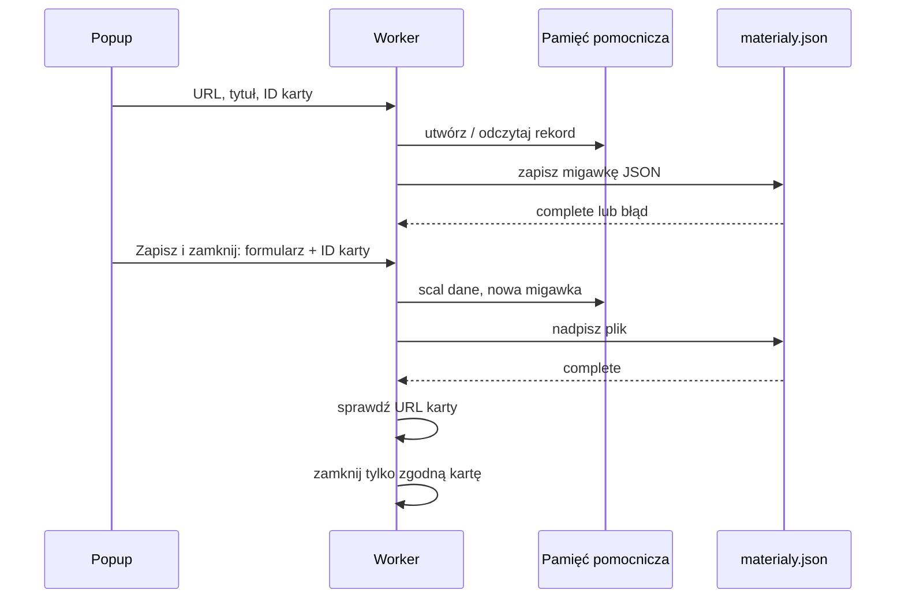

# Splot — plan projektu i implementacji rozszerzenia

Data: 9 września 2026 r.  
Wersja: 1.3 — istniejące repozytorium thigrand/splot utworzone przez użytkownika.  
Ustalenia użytkownika: [USTALENIA.md](USTALENIA.md).

Zatwierdzona nazwa robocza: **Splot**. Rozszerzenie: **Splot — zapisz i zamknij**. Istniejące repozytorium: [thigrand/splot](https://github.com/thigrand/splot), remote `https://github.com/thigrand/splot.git`. Uzgodniona ścieżka danych pozostaje `agregator/materialy.json` w folderze pobierania używanej przeglądarki.

## Cel

Pierwsza wersja rozwiązuje jeden problem: po znalezieniu materiału użytkownik zapisuje jego link i własny kontekst, a następnie zamyka kartę bez utraty informacji. To rozszerzenie dla przeglądarek opartych na Chromium. Użytkownik nie korzysta z Google Chrome; konkretną przeglądarkę do odbioru należy ustalić. Nie ma serwera, konta, AI, dashboardu ani listy zapisów.

Nazwy techniczne `chrome.*`, `minimum_chrome_version` oraz odnośniki do Chrome Extensions API pozostają poprawnymi nazwami używanego interfejsu. Nie zmieniać ich mechanicznie na `chromium.*`. Używany zestaw API, szczególnie `offscreen`, należy sprawdzić w docelowej przeglądarce. Zaliczenie testów w Google Chrome nie zastępuje testów w przeglądarce użytkownika i nie dowodzi zgodności ze wszystkimi wariantami Chromium.

Docelowo JSON zasili bazę wiedzy. `remember` będzie oznaczało trwały materiał z podsumowaniem; `summarize` — jednorazowy wynik bez dodania materiału do bazy wiedzy. W pierwszej wersji oba tryby są zapisywane jako dane, lecz nie są przetwarzane.

```text
Faza 1: rozszerzenie dla Chromium
      | URL + metadane + intencja
      v
Pobrane/agregator/materialy.json
      |
      v
Faza 2: importer i kolejka zadań
      |-- summarize --> jednorazowy wynik
      `-- remember  --> podsumowanie + baza wiedzy
                                      |
                                      v
                           dashboard, nauka, powtórki
```

Nie zaczynać od wielu usług ani bazy grafowej. Po MVP wystarczy jeden backend z kolejką, relacyjna baza danych i miejsce na pliki. Rzeczywiste dane z JSON pokażą, jakie źródła i formaty wymagają obsługi.

## Faza 1: zachowanie rozszerzenia

### Popup

Kliknięcie ikony rozszerzenia na stronie HTTP albo HTTPS:

1. Otwiera polski popup i odczytuje pełny URL, domenę oraz tytuł aktywnej karty.
2. Automatycznie tworzy wstępny rekord z tymi danymi oraz wartościami `important` i `remember`.
3. Daje pola: opcjonalny opis, opcjonalne tagi, ważność oraz tryb „Zapamiętaj” / „Podsumuj”.
4. Przycisk **„Zapisz i zamknij kartę”** zatwierdza formularz, aktualizuje plik i zamyka kartę dopiero po potwierdzonym zapisie.

Kliknięcie poza popupem zamyka go, odrzuca niezapisane zmiany formularza i zostawia kartę otwartą. Wstępny rekord URL pozostaje. Nie ma osobnego przycisku „Anuluj”.

Pierwsza wersja zbiera tylko URL, domenę, tytuł, opis, tagi, ważność, intencję i daty. Nie pobiera treści strony ani zaznaczonego tekstu, obrazów, dokumentów, transkrypcji i multimediów. Nie zawiera listy, wyszukiwarki, strony kolekcji, importu ani ręcznego eksportu.

### Powtórzony URL

Tożsamość materiału to dokładny pełny URL: parametry, fragment `#`, subdomena i końcowy ukośnik są znaczące. Nie usuwać parametrów śledzących i nie rozpoznawać kanonicznych adresów.

Przy powtórzeniu URL formularz pokazuje istniejący rekord:

- nowe tagi są dołączane do istniejących bez duplikatów;
- zatwierdzone wartości opisu, ważności i intencji zastępują wcześniejsze;
- pusty opis świadomie usuwa poprzedni opis;
- `createdAt` pozostaje, a `updatedAt` zmienia się wyłącznie przy rzeczywistej zmianie;
- samo otwarcie popupu nie nadpisuje istniejących danych wartościami domyślnymi.

### Znaczenie wartości

| Pole | Wartości | Znaczenie docelowe |
|---|---|---|
| `importance` | `important` (domyślnie), `less_important` | `important`: zachować istotną treść, formę, przykłady i kontekst; syntezować oszczędnie. `less_important`: można swobodnie przekształcać formę, jeśli zachowany jest sens. To nie jest ocena wiarygodności. |
| `intent` | `remember` (domyślnie), `summarize` | `remember`: trwały materiał dla bazy wiedzy z podsumowaniem. `summarize`: jednorazowe podsumowanie bez materiału w docelowej bazie wiedzy. |

W lokalnej pierwszej wersji oba tryby są rejestrowane w JSON. Nie tworzyć podsumowania ani trzeciej wartości „research”.

## Automatyczny plik

Rozszerzenie aktualizuje jeden plik:

```text
<folder pobierania używanej przeglądarki>/agregator/materialy.json
```

Zwykle będzie to `Pobrane/agregator/materialy.json`. W używanym Downloads API parametr `filename` jest ścieżką względną wobec ustawionego przez użytkownika folderu pobierania, a nie dowolną ścieżką na dysku. Użyć:

```js
filename: 'agregator/materialy.json'
conflictAction: 'overwrite'
saveAs: false
```

Używać `saveAs: false` i sprawdzić na docelowym profilu przeglądarki użytkownika, czy zapis nie wyświetla dialogu. Ustawienia, polityki przeglądarki i inne rozszerzenia mogą wpływać na pobieranie; nie zmieniać ich automatycznie. Wymagane uprawnienie to `downloads`; treść komunikatu uprawnień sprawdzić podczas instalacji.

Samo `chrome.downloads.download()` zwraca tylko identyfikator uruchomionego pobrania. Sukces następuje dopiero po zdarzeniu stanu `complete`. Dla `interrupted` albo błędu uruchomienia popup pokazuje błąd i ponowienie, a karta nie jest zamykana.

Źródła: [Chrome Downloads API](https://developer.chrome.com/docs/extensions/reference/api/downloads), [lista uprawnień](https://developer.chrome.com/docs/extensions/reference/permissions-list).

### Przygotowanie pliku niezależnie od popupu

Wybrany mechanizm: worker koordynuje zapis, a mały dokument `offscreen.html` z `offscreen.js` tworzy Blob UTF-8 i jego URL. Worker tworzy dokument przez `chrome.offscreen.createDocument()` z powodem `BLOBS`; istniejący dokument znajduje przez `chrome.runtime.getContexts()`. Manifest wymaga dodatkowego uprawnienia `offscreen` i deklaruje `minimum_chrome_version: "116"` zgodnie z dostępnością API w Chrome. To nie jest gwarancja zgodności każdego wariantu Chromium — rzeczywistą obsługę trzeba potwierdzić w docelowej przeglądarce. Dokument jest niewidoczny i nie jest stroną kolekcji ani osobną aplikacją. Źródło: [Chrome Offscreen API](https://developer.chrome.com/docs/extensions/reference/api/offscreen).

Worker przekazuje gotowy JSON wiadomością adresowaną do offscreen. Offscreen zwraca URL Bloba, a `downloads.download()` uruchamia worker. Offscreen nie wywołuje Downloads API ani Storage API — komunikuje się przez `runtime`. Po zakończeniu albo przerwaniu pobrania worker zleca zwolnienie URL. Dokument można zamknąć, gdy żaden zapis go nie potrzebuje. Nie generować URL Bloba w popupie ani nie próbować wywoływać `URL.createObjectURL()` w service workerze. Jedna obietnica tworzenia chroni przed równoległym otwarciem dwóch dokumentów. To decyzja techniczna, nie dodatkowa funkcja interfejsu.

## Niezawodność zapisu



- Popup zbiera dane; worker wykonuje trwałe operacje. Popup może zniknąć po kliknięciu poza nim, a worker może zostać później uśpiony.
- `chrome.storage.local` przechowuje rekordy, rosnący numer migawki i informację o nieudanym zapisie. Jest kopią pomocniczą, a nie substytutem pliku.
- Worker ma pojedynczą kolejkę zmian i pobrań. Nie uruchamia dwóch nadpisań równocześnie, żeby starsza migawka nie cofnęła nowszej.
- Kliknięcie „Zapisz i zamknij kartę” zawsze wysyła pełny aktualny formularz. Nie zależy od wcześniejszych zdarzeń wpisywania; ostatni znak nie może zginąć.
- Zmiany formularza przed kliknięciem przycisku są wyłącznie w popupie. Kliknięcie poza popupem ich nie wysyła.
- Po stanie `complete` worker odczytuje kartę po ID i porównuje jej bieżący URL z przechwyconym URL. Gdy karta zniknęła, użytkownik przeszedł na inną stronę albo URL nie daje się bezpiecznie odczytać, plik pozostaje zapisany, lecz karta nie jest zamykana.
- Ręczna edycja lub usunięcie pliku nie jest importowane. Następny udany zapis odtwarza aktualny stan rozszerzenia. Import i dwukierunkowa synchronizacja są poza MVP.

Trwały stan pomocniczy powinien obejmować `revision`, `lastCompletedRevision`, aktualne rekordy i identyfikator aktywnego pobrania wraz z jego rewizją. Na zimnym starcie workera uzgodnić ten stan z `downloads.search({id})` przed uruchomieniem nowego nadpisania. Rejestracja listenerów odbywa się na najwyższym poziomie modułu; event obsłużyć w tej samej kolejce, co inne zmiany. Nie trzymać wyłącznej kopii oczekującego zapisu w zmiennej globalnej. Po uzyskaniu ID pobrania ponownie odczytać jego stan, aby nie zgubić bardzo szybkiego `complete`. Nie trzymać kolejki mutacji zablokowanej obietnicą, którą może rozwiązać wyłącznie event czekający w tej samej kolejce.

Zamknięcie karty dotyczy wyłącznie operacji zatwierdzonej przyciskiem i migawki obejmującej tę operację. Potwierdzenie wcześniejszego wstępnego zapisu nie wystarcza. Po restarcie całej przeglądarki można odtworzyć zapis, ale nie wykonywać starego żądania zamknięcia po zapamiętanym ID karty. Brak lub uszkodzenie istniejącego stanu danych ma dawać błąd, a nie automatyczny reset i nadpisanie pliku pustą kolekcją.

Zamykanie popupu przed zatwierdzeniem odrzuca formularz; po przyjęciu zatwierdzenia przez worker nie cofa operacji. Zamknięcie karty przez inną akcję nie może zamknąć zamiast niej karty aktualnie aktywnej. Błąd lokalnego zapisu przerywa operację przed pobraniem i zamknięciem. Kolejka ma nadal przyjmować następne operacje po błędzie. Przy ponowieniu tego samego formularza nie tworzyć drugiego rekordu.

`storage.local` ma ograniczoną pojemność; obsłużyć odmowę zapisu i nie pokazywać wtedy sukcesu. Zwykły restart nie usuwa danych, lecz odinstalowanie rozszerzenia usuwa jego pamięć. README powinien wyjaśniać, że pozostający plik JSON nie jest automatycznie importowany po ponownej instalacji. Źródło: [Storage API](https://developer.chrome.com/docs/extensions/reference/api/storage).

## Kontrakt JSON

Każde nadpisanie tworzy pełną migawkę UTF-8. Rekordy sortować po `createdAt`, a przy remisie po `id`.

```json
{
  "schemaVersion": 1,
  "exportedAt": "2026-09-09T18:00:00.000Z",
  "materials": [
    {
      "id": "ad9b26e7-7213-4f71-9d68-2ee7f44b4358",
      "url": "https://example.org/artykul?source=social#fragment",
      "domain": "example.org",
      "title": "Przykładowy materiał o relacjach",
      "description": "Chcę wrócić do przykładu rozmowy.",
      "tags": ["relacje", "komunikacja"],
      "importance": "important",
      "intent": "remember",
      "createdAt": "2026-09-09T17:58:00.000Z",
      "updatedAt": "2026-09-09T17:59:00.000Z"
    }
  ]
}
```

| Pole | Reguła |
|---|---|
| `schemaVersion` | Zawsze `1`. |
| `exportedAt` | Czas utworzenia migawki, ISO 8601 UTC. |
| `id` | UUID z `crypto.randomUUID()`, nadawany raz. |
| `url` | Dokładny HTTP(S) URL aktywnej karty. |
| `domain` | `new URL(url).hostname.toLowerCase()`; zawiera subdomenę, bez portu. |
| `title` | Tytuł karty z pierwszego zapisu; pusty ciąg dozwolony. |
| `description` | Tekst opcjonalny, domyślnie pusty, maksymalnie 4000 znaków. |
| `tags` | Maksymalnie 30 unikalnych tagów, każdy do 60 znaków; wprowadzane po przecinkach. |
| `importance` | `important` albo `less_important`. |
| `intent` | `remember` albo `summarize`. |
| `createdAt`, `updatedAt` | Daty ISO 8601 UTC nadawane przez worker. |

Tagi porównywać bez rozróżniania wielkości liter, ale zachowywać pisownię pierwszego wystąpienia. Normalizować je przy zatwierdzeniu, nigdy przez przepisywanie aktywnego pola tekstowego podczas wpisywania.

## Implementacja przez tańszy model

Użyć Manifest V3, HTML, CSS i modułów JavaScript. Bez frameworka, bundlera, bibliotek, serwera, watchera oraz długich procesów.

```text
extension/
  manifest.json
  background.js       # kolejka, storage, plik, zamykanie kart
  material.js         # walidacja, scalanie, serializacja
  offscreen.html      # niewidoczny dokument potrzebny do utworzenia Blob URL
  offscreen.js        # tworzenie i zwalnianie Blob URL, komunikacja runtime
  popup.html
  popup.js
  styles.css
tests/
  material.test.js
  background.test.js
package.json          # node --test, bez zależności
README.md
```

Początkowy manifest (każdy wskazany plik musi istnieć):

```json
{
  "manifest_version": 3,
  "name": "Splot — zapisz i zamknij",
  "version": "0.1.0",
  "minimum_chrome_version": "116",
  "incognito": "not_allowed",
  "permissions": ["activeTab", "storage", "downloads", "offscreen"],
  "background": { "service_worker": "background.js", "type": "module" },
  "action": { "default_popup": "popup.html" }
}
```

Nie dodawać `tabs`, `scripting`, `<all_urls>`, content scripts, host permissions, cookies, historii, `unlimitedStorage` ani `downloads.open`. `activeTab` pozwala po kliknięciu ikony uzyskać URL i tytuł bieżącej karty bez stałego dostępu do wszystkich stron. `tabs.remove()` zamyka konkretną kartę i nie wymaga osobnego uprawnienia `tabs`. Źródła: [activeTab](https://developer.chrome.com/docs/extensions/develop/concepts/activeTab), [Tabs API](https://developer.chrome.com/docs/extensions/reference/api/tabs), [Storage API](https://developer.chrome.com/docs/extensions/reference/api/storage).

Kolejność prac:

1. Utwórz manifest, popup i worker; załaduj folder jako rozpakowane rozszerzenie.
2. Napisz i przetestuj czyste reguły: URL, domena, tagi, enumy, rekord domyślny oraz scalanie.
3. Dodaj `storage.local` i kolejkę workera; przechwyć rekord po URL bez resetowania duplikatu.
4. Zaimplementuj generowanie Bloba w dokumencie offscreen i pobranie przez worker do `agregator/materialy.json`. Najpierw sprawdź w rzeczywistej przeglądarce Chromium używanej przez użytkownika dostępność API, utworzenie pliku, nadpisywanie, polskie znaki i ukończenie zapisu po zamknięciu popupu. Następnie podłącz pełną migawkę danych. Nie pozostawiaj kilku alternatywnych mechanizmów zapisu.
5. Obsłuż `complete`, `interrupted`, ponowienie i kolejkę migawek. Dodaj czytelne stany zapisu.
6. Zbuduj formularz. Kliknięcie poza popupem nie zatwierdza pól.
7. Dodaj „Zapisz i zamknij kartę” dopiero po gotowym zapisie pliku i bezpiecznej weryfikacji karty.
8. Napisz README: instalacja, uprawnienie pobrań, ustawienie pobierania, prywatność, ograniczenia i brak importu.
9. Wykonaj testy odbioru i wpisz ich wynik do `tasks/todo.md`.

## Kryteria odbioru

| ID | Scenariusz | Oczekiwany wynik |
|---|---|---|
| T01 | Pierwsze kliknięcie na HTTP(S) | Rekord zawiera URL, domenę, tytuł, `important`, `remember`; plik jest aktualizowany. |
| T02 | Adres wewnętrzny przeglądarki, brak URL albo błąd odczytu | Komunikat, brak pustego rekordu i brak zamknięcia karty; obsługiwać tylko HTTP(S). |
| T03 | Polski opis, tagi i zmienione enumy | Poprawny JSON UTF-8 z oczekiwanymi wartościami. |
| T04 | Dwa zapisy identycznego URL | Jeden rekord; tagi są połączone, nowszy opis / ważność / intencja wygrywają. |
| T05 | Klik poza popupem po edycji | Karta zostaje; niezapisane pola nie trafiają do danych; wstępny URL pozostaje. |
| T06 | „Zapisz i zamknij kartę” | Pełna migawka osiąga `complete`, dopiero wtedy właściwa karta się zamyka. |
| T07 | Błąd lub `interrupted` | Karta zostaje, UI umożliwia ponowienie, dane pomocnicze pozostają. |
| T08 | Nawigacja karty podczas zapisu | Dane są zapisane; nowa strona nie zostaje zamknięta. |
| T09 | Szybkie kolejne zapisy | Końcowy plik ma najnowsze zatwierdzone dane. |
| T10 | Restart docelowej przeglądarki po sukcesie | Plik i pomocnicze dane są dostępne. |
| T11 | Ręczna zmiana/usunięcie pliku | Następny zapis odtwarza bieżącą migawkę rozszerzenia; README to wyjaśnia. |
| T12 | Przekroczenie limitów pól | Komunikat, bez cichego ucięcia i fałszywego sukcesu. |
| T13 | HTML w tytule lub opisie | Wyświetla się jako tekst, bez wykonania kodu. |
| T14 | Popup znika podczas wstępnego zapisu lub po przyjęciu zatwierdzenia | Pobranie nie zależy od popupu; wcześniejsze niezatwierdzone pola są odrzucone, przyjęte zatwierdzenie jest kontynuowane. |
| T15 | Worker startuje ponownie podczas pobrania; bardzo szybkie `complete` | Odtwarza stan, nie rozpoczyna konkurencyjnego nadpisania i nie gubi potwierdzenia. |
| T16 | Dwa okna zapisują równolegle ten sam lub różne URL | Nie giną rekordy; identyczny URL ma jeden rekord; suma tagów zachowana, ostatnie zatwierdzenie wygrywa dla pozostałych pól. |
| T17 | Storage odmawia zapisu albo zapisany stan jest uszkodzony | Brak fałszywego sukcesu, zamknięcia karty i resetowania zbioru; błąd nie blokuje następnych poprawnych operacji. |

Testy logiki nie wystarczą: T01, T03, T06–T11 oraz T14–T16 trzeba sprawdzić w rzeczywistej przeglądarce Chromium użytkownika i podać jej nazwę oraz wersję w raporcie. Używać kontrolowanych kart testowych i testowego profilu, aby nie zamykać rzeczywistych kart użytkownika. Jeśli sprawdzono inną przeglądarkę, jawnie zaznaczyć brak odbioru w docelowej. Nie rozbudowywać MVP o obsługę dodatkowych silników ani dużą macierz przeglądarek. Nie uruchamiać serwera.

## Repozytorium GitHub

Użytkownik utworzył repozytorium [thigrand/splot](https://github.com/thigrand/splot). Odczyt metadanych GitHub potwierdził `clone_url: https://github.com/thigrand/splot.git`, widoczność publiczną i domyślną gałąź `main`. Wykorzystać to repo; nie tworzyć kolejnego i nie zmieniać widoczności. Stan zdalnej historii sprawdzić ponownie przed podłączeniem i pushem.

1. Sprawdzić lokalny stan Git, remotes, skonfigurowaną tożsamość oraz zdalne referencje `https://github.com/thigrand/splot.git`. Jeśli katalog nie jest repozytorium, bezpiecznie przygotować lokalny Git z zachowaniem obecnych plików. Jeśli repo zdalne ma już historię, oprzeć pracę na niej; nie tworzyć niezależnej historii wymagającej nadpisania zdalnych commitów. Nie zmieniać globalnej konfiguracji tożsamości ani nie wymyślać adresu e-mail autora.
2. Dodać `.gitignore` przed pierwszym commitem. Wykluczyć rzeczywiste `materialy.json`, kopie kolekcji, katalog danych lokalnych, profile przeglądarki, sekrety, `.env`, zależności i raporty testowe. Nie ignorować wszystkich plików JSON — manifest i konfiguracja są kodem projektu. Dane testowe mają być syntetyczne.
3. Ustawić brakujący `origin` na `https://github.com/thigrand/splot.git`; równoważny istniejący adres SSH jest poprawny. Jeśli remote wskazuje inny projekt, nie nadpisywać go automatycznie — rozstrzygnąć to jednym pytaniem. Nie wykonywać polecenia tworzenia repozytorium.
4. Commitować jawnie wybrane pliki projektu: kod, testy, README i dokumentację. Przed pushem sprawdzić staged diff pod kątem rzeczywistych linków i sekretów. Nie dodawać prywatnych plików ze zbioru materiałów nawet do prywatnego repo.
5. Wysłać zwykłym pushem na `main`, bez force push i bez publikacji w sklepie z rozszerzeniami. Potwierdzić URL repo, zachowaną widoczność i zgodność SHA ostatniego lokalnego commita ze zdalnym.

Brak poświadczeń do pusha nie blokuje lokalnej implementacji. W takim przypadku przygotować i przetestować kod, a następnie wskazać konkretny brak potrzebny do zakończenia wysłania na GitHub. Dostęp konektora GitHub nie musi oznaczać dostępnego uwierzytelniania lokalnego Git. Samo przygotowanie tego promptu nie inicjalizuje lokalnego repo ani nie wykonuje pusha.

## Dalsze fazy

### Import i przetwarzanie

Zbudować importer JSON z walidacją i idempotencją po `id`. Rozdzielić dane na materiał, pozyskaną treść, zadanie i wynik. Dodać kolejkę ze stanami `queued`, `running`, `succeeded`, `failed`, `needs_input`.

Pozyskiwanie treści ma być jawne: artykuł, transkrypcja, post, obraz i PDF wymagają różnych wejść. Brak dostępu albo materiał za logowaniem jest stanem zadania, nie powodem do pozornego podsumowania. Przed wysyłaniem danych do modelu ustalić dostawcę, budżet, retencję i zgodę.

### Baza wiedzy i nauka

`summarize` daje jednorazowy wynik z informacją o kompletności materiału. `remember` korzysta z tego samego pozyskania i podsumowania, a następnie proponuje temat i rozwija wersjonowaną bazę wiedzy. Zacząć od tematów oraz relacji wiele-do-wielu w zwykłej bazie relacyjnej. Zachować źródła, różnice, sprzeczności, ręczne dane użytkownika i osobne etykiety modelu.

Dla ważnych materiałów można później projektować powtórki, pytania i przykłady zastosowania. Powiadomienia wymagają osobnej decyzji o kanale, częstotliwości, zgodzie, pauzie i limicie.

## Stan pracy

Plan jest gotowy do implementacji MVP. Kod rozszerzenia, serwer, konto, AI i powiadomienia nie zostały utworzone. Przed implementacją należy przeczytać ten dokument i [USTALENIA.md](USTALENIA.md), a następnie prowadzić checklistę w `tasks/todo.md`.
