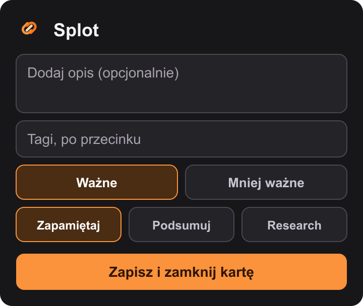

# Splot — zapisz i zamknij

Pierwsza wersja rozszerzenia Manifest V3 dla wskazanej przez użytkownika przeglądarki opartej na Chromium. Zapisuje aktywny link wraz z krótkim kontekstem do lokalnego pliku, a po pomyślnym zapisie może zamknąć tę konkretną kartę.

Nie ma tu konta, backendu, AI, pobierania treści, listy materiałów ani importu.

Aktualna wersja: **0.2.0**. Splot stosuje [Semantic Versioning](https://semver.org/lang/pl/): przed wersją 1.0 nowa widoczna funkcja podnosi drugi numer (`0.2.0`), a poprawka bez zmiany zachowania — trzeci (`0.2.1`).



## Instalacja w Brave

1. Otwórz w Brave adres `brave://extensions`.
2. Włącz **Tryb programisty** w prawym górnym rogu.
3. Wybierz **Załaduj rozpakowane**.
4. Wskaż folder [`extension`](extension).
5. Sprawdź komunikat o uprawnieniu do pobierania plików i zaakceptuj go, jeśli przeglądarka o to poprosi.
6. W ustawieniach pobierania pozostaw automatyczne pobieranie (bez pytania o lokalizację), aby rozszerzenie mogło utworzyć plik bez okna dialogowego.

Rozszerzenie zapisuje plik względnie do folderu pobierania skonfigurowanego w przeglądarce:

```text
agregator/materialy.json
```

Na typowym profilu będzie to `Pobrane/agregator/materialy.json`. Rozszerzenie nie wybiera folderu za użytkownika i nie zmienia ustawień przeglądarki.

## Użycie

1. Otwórz zwykłą stronę HTTP albo HTTPS i kliknij ikonę Splot.
2. Już przy otwarciu popupu powstaje wstępny rekord: pełny URL, domena, tytuł, `important` oraz `remember`.
3. Opcjonalnie wpisz opis i tagi rozdzielone przecinkami; wybierz ważność i intencję.
4. Kliknij **Zapisz i zamknij kartę**. Splot zapisze pełną migawkę JSON i zamknie kartę wyłącznie po otrzymaniu przez pobieranie stanu `complete`.

Zamknięcie popupu kliknięciem poza nim nie zatwierdza formularza i nie zamyka karty. Wstępny link pozostaje w pomocniczej pamięci rozszerzenia i jest zapisywany do pliku.

Ten sam pełny URL oznacza jeden rekord: tagi są łączone bez rozróżniania wielkości liter, a zatwierdzony opis, ważność i intencja zastępują poprzednie wartości. Parametry, fragment `#`, subdomena oraz końcowy ukośnik są częścią URL i nie są normalizowane.

Intencje `remember`, `summarize` i `research` są zapisywane w JSON. W tej wersji żadna z nich nie uruchamia AI ani researchu automatycznie.

## Niezawodność i ograniczenia

- Worker utrzymuje jedną kolejkę operacji, aby dwie migawki nie nadpisały się równolegle.
- Stan roboczy znajduje się w `chrome.storage.local`; po restarcie workera sprawdzany jest wcześniejszy identyfikator pobrania. Stary wniosek o zamknięcie karty nie jest odtwarzany po restarcie.
- Gdy pobieranie zostanie przerwane lub nie uruchomi się, karta zostaje otwarta, a popup pokazuje błąd. Ponowne kliknięcie przycisku wykonuje nową próbę.
- Przed zamknięciem Splot ponownie odczytuje kartę według ID i porównuje jej URL z URL-em zapisu. Po przejściu na inną stronę karta nie jest zamykana.
- Ręczna edycja albo usunięcie `materialy.json` nie jest importowana. Następny udany zapis odtwarza aktualną migawkę z pamięci rozszerzenia.
- Odinstalowanie rozszerzenia usuwa jego pomocniczą pamięć. Istniejący plik JSON nie jest automatycznie importowany po ponownej instalacji.
- Obsługiwane są wyłącznie strony HTTP(S). Strony wewnętrzne przeglądarki i nieprawidłowe adresy są odrzucane.
- Opis może mieć do 4000 znaków; można podać najwyżej 30 tagów po 60 znaków każdy. Limity zwracają błąd, a nie skracają danych po cichu.

## Prywatność

Splot działa lokalnie. Nie wysyła URL-i, tytułów, opisów ani tagów do serwera. Plik JSON trafia wyłącznie do folderu pobierania bieżącego profilu przeglądarki.

## Sprawdzenie

Automatyczne testy logiki i kolejki:

```text
npm test
```

Do odbioru ręcznego w Brave użyj testowego profilu oraz kontrolowanych kart, nie rzeczywistych kart ani prywatnego zbioru materiałów. Wyniki testów przeglądarkowych są zapisywane w [`tasks/todo.md`](tasks/todo.md).
